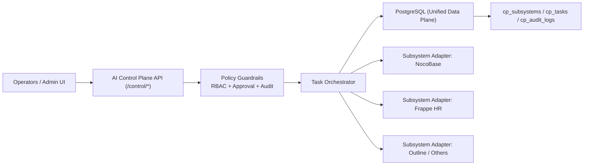

# AI Control Plane (PostgreSQL Unified Management)

## Architecture



## What Is Implemented

- PostgreSQL-backed control tables:
  - `cp_subsystems`: subsystem registry and capabilities
  - `cp_tasks`: AI management tasks with risk + status
  - `cp_audit_logs`: immutable operation trail
- Control APIs in `server/controlPlane/router.js`
- Guardrails:
  - High-risk tasks require approval (`pending_approval -> approved -> completed`)
  - SQL protection blocks dangerous statements (`DROP/TRUNCATE/ALTER/...`)
  - All key actions are audited

## API Endpoints

- `GET /control/health`
- `GET /control/subsystems`
- `POST /control/subsystems`
- `GET /control/tasks`
- `POST /control/tasks`
- `POST /control/tasks/:id/run`
- `POST /control/tasks/:id/approve`
- `GET /control/audit`
- `GET /control/report?hours=24`

Optional admin headers:

- `x-admin-token`: checked when `ADMIN_TOKEN` is set
- `x-admin-user`: audit actor identity

## Quick Start

1. Start infra:

```bash
docker compose up -d --build
```

2. Register a subsystem:

```bash
curl -X POST http://localhost:3000/control/subsystems \
  -H "Content-Type: application/json" \
  -d "{\"id\":\"frappe-hr\",\"name\":\"Frappe HR\",\"kind\":\"hr\",\"baseUrl\":\"http://frappe-hr:8000\",\"capabilities\":[\"employee_query\"]}"
```

3. Create a PostgreSQL read task:

```bash
curl -X POST http://localhost:3000/control/tasks \
  -H "Content-Type: application/json" \
  -d "{\"target\":\"postgres\",\"action\":\"sql_read\",\"riskLevel\":\"low\",\"payload\":{\"sql\":\"SELECT id,name,kind,status FROM cp_subsystems\"}}"
```

4. Create a high-risk write task (approval required):

```bash
curl -X POST http://localhost:3000/control/tasks \
  -H "Content-Type: application/json" \
  -d "{\"target\":\"postgres\",\"action\":\"sql_write\",\"riskLevel\":\"high\",\"payload\":{\"sql\":\"UPDATE cp_subsystems SET status='inactive' WHERE id='frappe-hr'\"}}"
```

5. Approve and execute:

```bash
curl -X POST http://localhost:3000/control/tasks/<task_id>/approve
```
